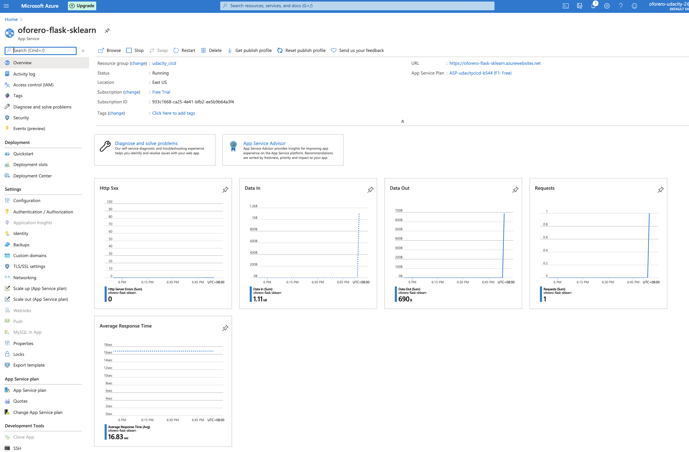
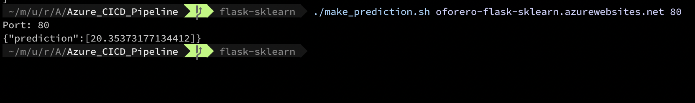
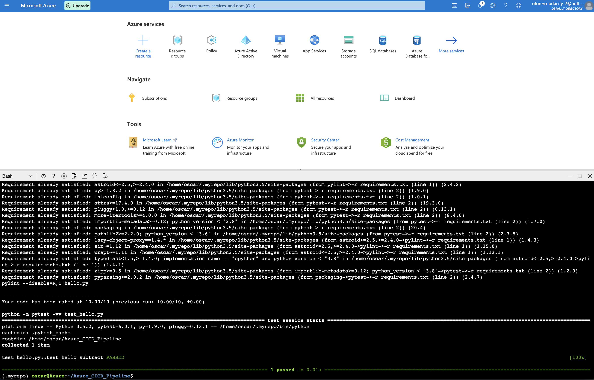
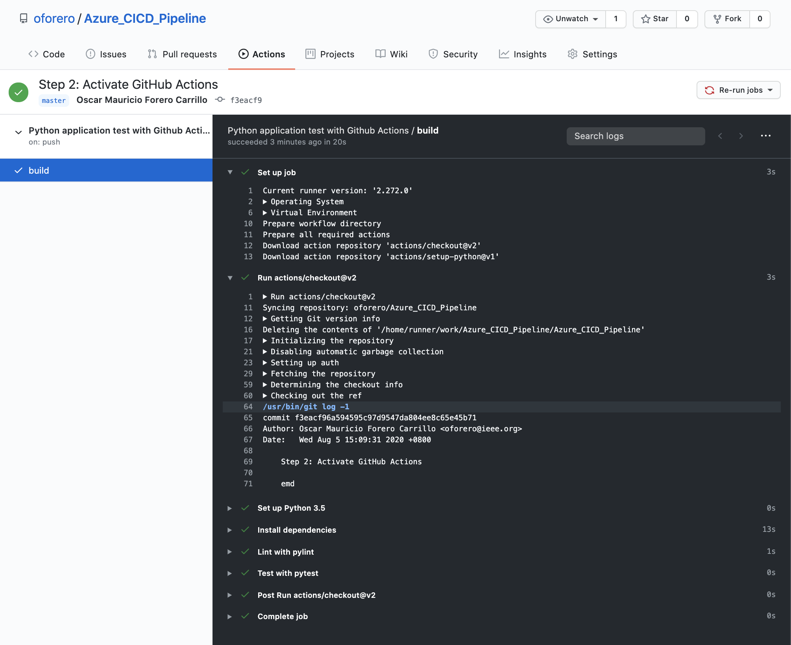
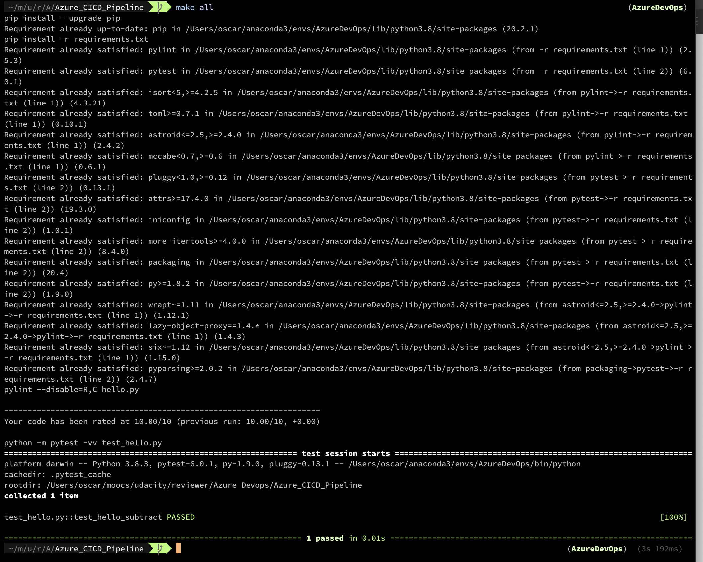

# Overview

This is a Web Service that uses a pretrained model to predict Boston house prices.
The web service is deployed to Azure as an App service.

## Project Plan

* Trello: https://trello.com/b/DglsTOf3/udacity-ci-cd
* Spred Sheet: https://docs.google.com/spreadsheets/d/1RVkXWyg3vh1xjo7_pgdA8kCZQgEEg9pqjFrYXtfy8wY/edit?usp=sharing

## Instructions

### Running the App Locally with Docker

To run the app locally you need to be running Docker. 
Go to the `flask-sklearn` directory and execute the script to start a container running the app:

```
$ cd flask-sklearn
$ ./run_docker.sh
```


Open a new terminal, go to the same directory and execute the client call:

```
$ cd flask-sklearn
$ ./make_prediction.sh
```

You can adjust the prediction by editing the CURL call in that script.


## Other Screenshots

* Project running on Azure App Service





* Project cloned into Azure Cloud Shell



* GitHub Actions



* Passing tests that are displayed after running the `make all` command from the `Makefile`


* Output of a test run


* Successful run of the project in Azure Pipelines



* Running Azure App Service


* Successful prediction from deployed flask app in Azure Cloud Shell> 


## Enhancements

The most obvious enhancement is to add a Web GUI for the application to allow users to make predictions interactively.

After that adding support for more cities is the most obvious next step.

## Demo 

[YouTube](https://youtu.be/zdNKFQAF6z0)


